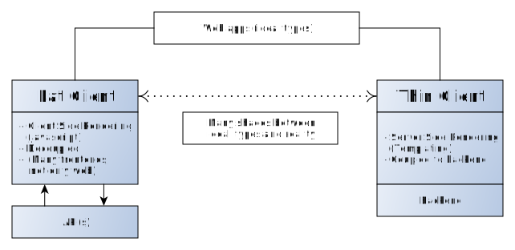
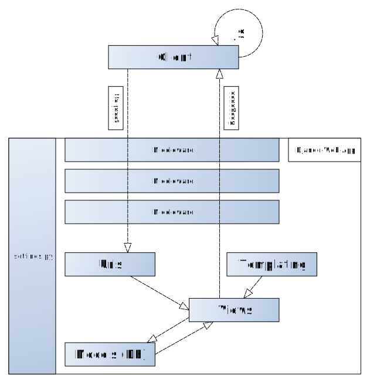
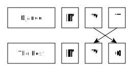

# Django 101

An introduction to the web framework Django.

## Web App Types

The following graph shows a simplified model of the two web app ideal types.




## How Django Works (Thin Client)

The following graph shows a simplified model of the inner workings of Django with focus on server-side-rendering (via templating) and some JavaScript (JS) usage on the client side.



## Model-View-What?

Django's Model-View-Template (MVT) design pattern is differently named from the rest of the world's Model-View-Controller (MVC) design pattern.

Simplified:



## Why Django?

- Batteries included (e.g. admin backend)
- Fast development time
- Many third-party [packages](https://djangopackages.org/)
- Django's Object Relational Mapping (ORM) is easy
- [GeoDjango](https://docs.djangoproject.com/en/2.1/ref/contrib/gis/) for building GIS apps
- [WAM](https://github.com/rl-institut/WAM)

## Say Hello!

Let's build an app.

[This tutorial was made on an GNU/Linux operating system (Ubuntu 18.04) and might be adjusted for usage with other operating systems]

- First you need Git, Python (>= 3.6) with Virtualenv and Pip installed. If you are under Linux/Mac this should be a no-brainer, if you use Windows and you don't have a Git, Python, Virtualenv and Pip workflow yet, please read this [tutorial](http://timmyreilly.azurewebsites.net/python-pip-virtualenv-installation-on-windows/) for Pip and Virtualenv installation/usage and visit this [link](https://git-scm.com/download/win) to download/install Git.
- If not already downloaded/installed, download/install Git, Python (>= 3.6), Pip (normally comes with Python) and Virtualenv
- Open the console (aka terminal, shell) on your computer
- Create a project directory in your terminal:
```
mkdir -p path/to/projectfolder
```
- CD into your project directory:
```
cd path/to/projectfolder
```
- Create a virtual environment with Virtualenv:
```
virtualenv venv --python=python3.6
```
- Activate the virtual environment:
```
source venv/bin/activate
```
- Install Django:
```
pip install django
```
- Initialize Django project:
```
django-admin startproject hello_project
```
- CD into your "Django" project directory:
```
cd hello_project
```
- Initialize Django app:
```
python manage.py startapp hello_app
```
- Add hello_app to installed apps in hello_project/settings.py:
```
INSTALLED_APPS = [
    ...
    'hello_app',
]
```
- Create a model Person in hello_app/models.py:
```
from django.db import models


class Person(models.Model):
    first_name = models.CharField(max_length=30)
    last_name = models.CharField(max_length=30)

    def __str__(self):
        return '{} {}'.format(self.first_name, self.last_name)

```
- Register Person model in admin panel in hello_app/admin.py:
```
from django.contrib import admin
from .models import Person

admin.site.register(Person)

```
- Make migrations and migrate project:
```
python manage.py makemigrations
(Info: python manage.py showmigrations)
(Info: python manage.py sqlmigrate hello_app 0001)
python manage.py migrate
```
- Create an admin account:
```
python manage.py createsuperuser
```
- Start the development server:
```
python manage.py runserver
```
- Go to 127.0.0.1:8000/admin and add some persons.
- Create a view named hello in hello_app/views.py:
```
from django.shortcuts import render
from .models import Person


def hello(request):
    persons = Person.objects.all()
    context = {
        'persons': persons
    }
    return render(request, 'hello_app/hello.html', context)

```
- Create an template folder in hello_app/templates/hello_app:
```
mkdir -p hello_app/templates/hello_app
```
- Create an HTML template in hello_app/templates/hello_app/hello.html:
```
<!DOCTYPE html>
<html>
<head>
    <title>Hello App</title>
</head>
<body>
    <h1>Hello:</h1>
    
    <li>{{ person.first_name }} {{ person.last_name }}</li>
    
</body>
</html>
```
- Register your hello view to an URL in hello_project/urls.py:
```
...
from hello_app.views import hello

urlpatterns = [
    ...
    path('', hello),
]
```
- Go to 127.0.0.1:8000 and enjoy your very basic and not so nice looking app :wink:

## Knowledge

- Read the [official documentation](https://docs.djangoproject.com/en/2.1/) (its worth it)!
- Do the official get started [tutorial](https://docs.djangoproject.com/en/2.1/intro/)
- Two other, very good tutorials: [write a blog system (videos)](https://www.youtube.com/watch?v=UmljXZIypDc&list=PL-osiE80TeTtoQCKZ03TU5fNfx2UY6U4p), [write a simple geo app (with GeoDjango)](https://realpython.com/location-based-app-with-geodjango-tutorial/)
- Django [design philosophies](https://docs.djangoproject.com/en/2.1/misc/design-philosophies/)
